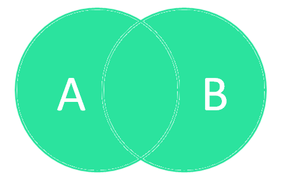
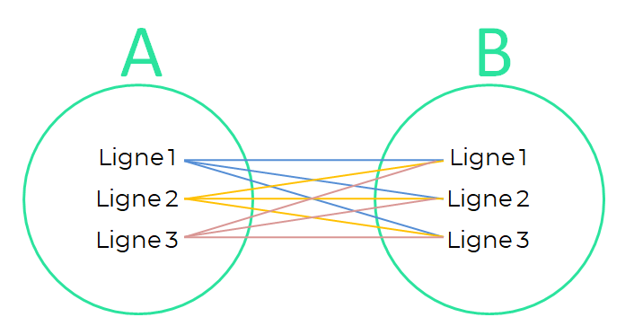

# Hello DBMS

### Questions sur la veille technologique 
#### A. Qu’est ce qu’une donnée ? Sous quelle forme peut-elle se présenter ?
Les données sont des informations qui ont été collectées et organisées dans un but précis. Elles peuvent être utilisées pour répondre à des questions, prendre des décisions ou même élaborer des stratégies. Ces données peuvent être de type numérique, textuel, graphique ou encore une combinaison des trois. Elles sont souvent recueillies auprès de diverses sources et stockées dans des bases de données ou d'autres dépôts numériques.

#### B. Donnez et expliquez les critères de mesure de qualité des données.
Tout d'abord la qualité d'une donnée se définit en fonction de l’usage attendu par ses utilisateurs.Le RGPD pose des limites bien précises aux traitements des données personnelles, sur tout le cycle de vie de la donnée. Une donnée stockée ou utilisée hors cadre réglementaire ne pourra donc pas être considérée comme une donnée de qualité bien qu’elle puisse apporter de l’efficience et de la valeur à l’organisation.

La qualité d’une donnée se mesure à travers ses caractéristiques intrinsèques, qu’elles soient internes ou externes à l’entreprise. Nous pouvons citer le profil, le exactitude, la complétude, la conformité, l'intégrité, la consistance, la disponibilité, l'applicabilité, l'intelligibilité, l'intégration, la flexibilité, la comparabilité, la cohérence etc. Rentrent en jeu également des critères de services comme la compréhensibilité, l’accessibilité ou la fraicheur de la donnée.

La qualité des données peut être dégradée à deux niveaux. Tout d’abord au niveau de la description des données avec, par exemple, des conflits entre noms d’objets ou des imprécisions sur la définition des objets. L’autre niveau est celui de la donnée en elle-même : valeurs nulles, doublons, valeurs anormales, données obsolètes…

La définition d’une donnée de mauvaise qualité :

- Inexacte : informations manquantes, incomplètes, chiffres faux, fautes d’orthographes…
- Non-conforme : par sa nature ou sa forme, la donnée ne respecte pas la législation ou les normes en vigueur.
- Non-contrôlée : un suivi insuffisant est porté sur la donnée qui peut doublonner avec une autre ou bien se dégrader avec le temps.
- Non-sécurisée ou non-fiable : si aucun contrôle n’est appliqué, les données deviennent des cibles pour le piratage de par leur vulnérabilité.
- Statique : les données qui ne sont pas actualisées deviennent obsolètes et perdent leur utilité.
- Dormante : sans actualisation ni partage, une donnée devient un poids mort dans votre référentiel et n’a plus de valeur.

#### C. Définissez et comparez les notions de Data Lake, Data Warehouse et LakeHouse. Illustrez les différences à l’aide de schémas.
Du début des années 90 à aujourd’hui, les données et les analyses faisables sur celles-ci ont beaucoup évolué. Les architectures possibles ont à leur tour changé, donnant naissance à 3 grands concepts : le data warehouse, le data lake et le data lakehouse.

**Définition du Data Warehouse**

Les données stockées dans les bases relationnelles pour les charges OLTP (Online Transaction Processing) sont archivées dans un Data Warehouse (une autre base de données relationnelle) pour pouvoir les analyser (OLAP / OnLine Analytical Processing) et générer des rapports compilant différentes métriques. La mise à disposition de la donnée se fait en général dans des Datamarts (RDBMS).

**Qu'est-ce qu'un Data Lake ?**

Ce concept apparaît après la naissance d’Hadoop en 2006 et a pour principe de stocker les données dans leur format RAW. On réplique tout simplement toutes les données intéressantes du SI : de la donnée relationnelle et donc structurée, des données semi-structurées comme des CSV, des logs ou des JSON, des données non-structurées comme des emails, des documents PDFs, ou des données binaires comme des images, des vidéos ou des fichiers audios. La technologie se cachant le plus souvent derrière ce terme c’est Hadoop.

**Et le Lakehouse ?**

Avec l’apparition du Serverless amené par les CSPs (Cloud Service Providers) est né un nouveau type d’architecture : le data lakehouse. Les analyses sont maintenant faisables sans gérer les infrastructures sous-jacentes. Les problématiques de gestion des serveurs sont mises de côté. Ici, l’idée est de stocker les données dans du stockage distribué (Amazon S3, Azure Blob Storage, Google Cloud Storage) et d’effectuer les analyses avec des infrastructures gérées par les CSPs (Amazon Athena, Amazon EMR, Databricks, Azure HDInsight, Google Dataproc).

#### D. Donnez une définition et des exemples de systèmes de gestion de bases de données avec des illustrations.

Un système de gestion de base de données (abr. SGBD) est un logiciel système servant à stocker, à manipuler ou gérer, et à partager des données dans une base de données, en garantissant la qualité, la pérennité et la confidentialité des informations, tout en cachant la complexité des opérations.

Un SGBD (en anglais DBMS pour database management system) permet d'inscrire, de retrouver, de modifier, de trier, de transformer ou d'imprimer les informations de la base de données. Il permet d'effectuer des comptes rendus des informations enregistrées et comporte des mécanismes pour assurer la cohérence des informations, éviter des pertes d'informations dues à des pannes, assurer la confidentialité et permettre son utilisation par d'autres logiciels1. Selon le modèle, le SGBD peut comporter une simple interface graphique jusqu'à des langages de programmation sophistiqués1.

Parmi les logiciels les plus connus il est possible de citer : MySQL, PostgreSQL, SQLite, Oracle Database, Microsoft SQL Server, Firebird ou Ingres. 

#### E. Qu’est ce qu’une base de données relationnelle ? Qu’est ce qu’une base de données non relationnelle ? Donnez la différence entre les deux avec des exemples d’applications.

Les bases de données relationnelles et non relationnelles sont deux méthodes de stockage de données pour les applications. Une base de données relationnelle (ou base de données SQL) stocke les données sous forme de table avec des lignes et des colonnes. Les colonnes contiennent des attributs de données et les lignes contiennent des valeurs de données. Vous pouvez lier les tables dans une base de données relationnelle pour mieux comprendre l'interconnexion entre les différents points de données. D'autre part, les bases de données non relationnelles (ou bases de données NoSQL) utilisent divers modèles de données pour accéder aux données et les gérer. Elles sont spécialement optimisées pour les applications qui nécessitent un volume de données important, une faible latence et des modèles de données flexibles, qui sont obtenus en assouplissant certaines des restrictions de cohérence des données des autres bases de données.

**Comment les bases de données relationnelles stockent-elles les données ?**

Les bases de données relationnelles stockent les données dans des tables comportant des colonnes et des lignes. Chaque colonne représente un attribut de données spécifique et chaque ligne représente une instance de ces données.

Vous attribuez à chaque table une clé primaire, c'est-à-dire une colonne d'identification qui identifie la table de manière unique. Vous utilisez la clé primaire pour établir des relations entre les tables. Vous l'utilisez pour relier les lignes entre les tables en tant que clé étrangère dans une autre table.

Une fois que deux tables sont connectées, vous pouvez obtenir des données à partir des deux tables à l'aide d'une seule requête. Vous écrivez des requêtes SQL pour interagir avec la base de données relationnelle.

Exemple de données stockées
Imaginons par exemple qu'un détaillant crée une table de tous ses produits. Dans cette table, vous pouvez avoir des colonnes pour les noms, les descriptions et le prix des produits. Une autre table contient des données sur les clients, leurs noms et les achats qu'ils ont effectués.

Les tables suivantes illustrent cette approche.

**Comment les bases de données non relationnelles stockent-elles les données ?**

Il existe plusieurs systèmes de bases de données non relationnelles en raison des variations dans la façon dont ils gèrent et stockent les données sans schéma. Les données sans schéma sont des données stockées sans les contraintes imposées par les bases de données relationnelles.

Ensuite, nous expliquons certains des types de bases de données non relationnelles les plus courants.

Bases de données clé-valeur

Une base de données clé-valeur stocke les données sous la forme d'un ensemble de paires clé-valeur. Dans une paire, la clé sert d'identifiant unique. Les clés et les valeurs peuvent se présenter sous toutes les formes, des objets simples aux objets composés complexes. 

Bases de données document

Les bases de données orientées documents ont le même format de modèle de document que celui utilisé par les développeurs dans leur code d'application. Ils stockent les données sous forme d'objets JSON qui sont flexibles, semi-structurés et hiérarchiques par nature.

L'exemple suivant montre à quoi peuvent ressembler les données stockées dans une base de données document.

Bases de données graphiques

Les bases de données orientées graphe sont conçues pour stocker et rechercher des relations. Elles recourent à des nœuds pour stocker les entités de données, ainsi qu'à des périphéries pour stocker les relations entre les entités.

Un arc possède toujours un nœud initial, un nœud final, un type et une direction. Il peut décrire, par exemple, les relations, les actions et la propriété parents-enfants. 

#### F. Définissez les notions de clé étrangère et clé primaire.

**Contraintes de clé primaire**

Une table contient généralement une colonne ou une combinaison de colonnes dont les valeurs identifient de façon unique chaque ligne dans la table. Cette colonne (ou ces colonnes), appelée clé primaire (PK, Primary Key), assure l'intégrité de l'entité de la table. Les contraintes de clé primaire garantissent des données uniques, c'est pourquoi elles sont souvent définies pour une colonne d'identité.

Lorsqu'on spécifie une contrainte de clé primaire pour une table, le moteur de base de données garantit l'unicité des données en créant automatiquement un index unique pour les colonnes de clé primaire. Cet index permet également l'accès rapide aux données lorsque la clé primaire est utilisée dans des requêtes. Si une contrainte de clé primaire est définie sur plusieurs colonnes, des valeurs peuvent apparaître en double dans une colonne, mais chaque combinaison de valeurs issues de toutes les colonnes de la définition de contrainte de clé primaire doit être unique.

**Contraintes de clé étrangère**

On appelle « clé étrangère » une colonne ou une combinaison de colonnes utilisée pour établir et conserver une liaison entre les données de deux tables pour contrôler les données qui peuvent être stockées dans la table de clés étrangères. Dans une référence de clé étrangère, la création d'une liaison entre deux tables s'effectue lors du référencement de la ou des colonnes contenant les valeurs de clé primaire d'une table dans la ou les colonnes de l'autre table. Cette colonne devient alors une clé étrangère dans la seconde table.

Par exemple, la table Sales.SalesOrderHeader a une liaison de clé étrangère avec la table Sales.SalesPerson, car il existe une relation logique entre les commandes et les vendeurs. La colonne SalesPersonID de la table SalesOrderHeader correspond à la colonne de clé primaire de la table SalesPerson. La colonne SalesPersonID de la table SalesOrderHeader est la clé étrangère de la table SalesPerson. Suite à la création de cette relation de clé étrangère, une valeur pour SalesPersonID ne peut pas être insérée dans la table SalesOrderHeader si elle n'existe pas déjà dans la table SalesPerson.

#### G. Quelles sont les propriétés ACID ?
L'acronyme ACID désigne les quatre propriétés clés qui définissent une transaction : atomicité, cohérence, isolement et durabilité. Si une opération de base de données présente ces propriétés ACID, elle peut être qualifiée de transaction ACID. Les systèmes de stockage de données qui appliquent ce type d'opérations sont appelés « systèmes transactionnels ». Avec les transactions ACID, chaque lecture, écriture ou modification d'une table présente les caractéristiques suivantes :

- Atomicité : chaque instruction d'une transaction (lecture, écriture, mise à jour ou suppression de données) est traitée comme une seule unité. Soit l'instruction est exécutée dans son intégralité, soit elle ne l'est pas du tout. Cette propriété empêche que des données soient perdues ou corrompues si, par exemple, la source de données de streaming s'interrompt à mi-parcours.
- Cohérence : les transactions ne modifient les tables que de façon prédéfinie et prévisible. La cohérence transactionnelle veille à ce qu'une corruption ou une erreur dans les données n'ait pas de conséquences inattendues sur l'intégrité de votre table.
- Isolement : lorsque plusieurs utilisateurs lisent et écrivent dans la même table simultanément, l'isolement de leurs transactions garantit que les transactions effectuées simultanément ne s'impactent pas les unes les autres. Les requêtes sont exécutées comme si elles étaient successives alors qu'elles sont en réalité simultanées.
- Durabilité : les modifications apportées à vos données par les transactions réussies sont enregistrées, même en cas de défaillance du système.

#### H. Définissez les méthodes Merise et UML. Quelles sont leur utilité dans le monde de l’informatique ? Donnez des cas précis d’utilisation avec des schémas.

Merise et UML sont deux méthodologies clés en modélisation de systèmes informatiques. Merise, développée en France dans les années 1970, se concentre sur la séparation des données et des traitements avec une forte orientation vers la modélisation de bases de données relationnelles. Elle utilise des outils comme le Modèle Conceptuel de Données (MCD) pour représenter les entités et leurs relations. En revanche, UML, apparu dans les années 1990, est un langage de modélisation standardisé qui s'adapte à divers types de systèmes informatiques. Il est particulièrement efficace dans la conception orientée objet, utilisant des diagrammes de classe, de séquence, et d'état pour représenter la structure et le comportement des systèmes. Tandis que Merise est souvent privilégiée pour des projets axés sur les données, notamment dans les contextes francophones, UML est universellement utilisé, adaptable aux diverses méthodologies de développement informatique.

#### I. Définissez le langage SQL. Donnez les commandes les plus utilisées de ce langage et les différentes jointures qu’il est possible de faire.

Le langage de requête structuré (SQL) est un langage de programmation permettant de stocker et de traiter des informations dans une base de données relationnelle. On peut utiliser des instructions SQL pour stocker, mettre à jour, supprimer, rechercher et récupérer des informations de la base de données. Vous pouvez également utiliser le langage SQL pour maintenir et optimiser les performances de la base de données.

Voici quelques exemples des différentes commande les plus utilisés en SQL : 

-> Select : Permet d’indiquer à SQL quelles sont les colonnes que l’on souhaite voir. Chaque ligne de données retournée par la requête comportera donc les colonnes indiquées dans cette partie.

-> From : Permet de spécifier de quelle table l’on souhaite lire une partie des données. Les données retournées appartiendront à la table spécifiée dans cette partie.

-> Join […] On : Joint plusieurs tables pour les utiliser comme une seule dans la partie précédente. Le « On » permet de spécifier sur quel critère commun faire correspondre les deux tables

-> Where : Agit comme un filtre afin d’indiquer quelle(s) condition(s) doivent respecter les données retournées. Il s’agit donc de l’équivalent du filtre que l’on applique à une colonne dans un tableau Excel

-> Group by : Permet de regrouper les données selon le critère indiqué. Notamment utile pour retourner des sommes ou des moyennes : par exemple, pour retourner la somme des produits achetés par un client, il faudra grouper les résultats par client

-> Order by : Permet de trier les données de manière croissante ou décroissante selon le critère spécifié. Il s’agit donc de l’équivalent du tri par colonne dans un tableau Excel
Limit : Indique si l’on souhaite limiter les résultats retournés à un certain nombre de lignes

**Les différents types de jointures SQL**

Il existe plusieurs instructions de jointures différentes. Chaque jointure a des caractéristiques particulières qu’il faut connaître avant de s’en servir. Bien choisir sa jointure peut te faire gagner du temps et t’éviter des problèmes !

**INNER JOIN**

Le INNER JOIN est une jointure qui permet d’associer les données de deux tables seulement s’il existe une correspondance. Ainsi, la nouvelle table associe les enregistrements (=lignes) que si la clé est identique. En mathématiques on appelle ça une intersection.

**LEFT JOIN**

Cette instruction réalise une jointure entre deux tables en gardant toutes les informations de la table de gauche. Les données de la table de droite sont associées à la table de gauche seulement si leur clé correspond.

Remarque : Quand on dit “à gauche” et “à droite”, on fait référence à l’ordre d’apparition des tables après la clause ON : table_gauche.attribut = table_droite.attribut. 

LEFT JOIN appartient à la famille des jointures OUTER JOIN. Si un enregistrement ne se situe pas dans la table de droite mais qu’il existe la table de gauche, alors on trouve la valeur NULL dans le dataset final. 

Contrairement à un INNER JOIN, un LEFT JOIN préserve les données de la table de gauche, même en l’absence de correspondance.

**LEFT JOIN sans intersection**

Cette jointure est un LEFT JOIN auquel on retire les enregistrements qui correspondent à la table de droite. Ainsi, on ne garde que les données de la table de gauche qui n’ont aucune correspondance avec la table de droite.

**RIGHT JOIN**

Cette requête SQL réalise une jointure en gardant toutes les informations de la table de droite. S’il n’y a pas de correspondance avec la table de gauche, la cellule de l’information manquante contient la valeur NULL. Il s’agit d’un OUTER JOIN aussi.

**RIGHT JOIN sans intersection**

Cette jointure est juste le RIGHT JOIN auquel on retire les enregistrements de la table de Gauche. Ainsi, on ne garde que les lignes de la table de droite qui n’ont aucune correspondance avec la table de gauche.

**FULL JOIN**

Le FULL JOIN va réaliser une jointure totale entre deux tables. On va prendre les enregistrements de toutes les tables et les mettre dans la table de résultat. Les cellules qui n’auront pas de correspondance dans les deux tables en auront pour valeur : NULL.

Cette jointure n'exclut aucune donnée, ni à droite ni à gauche. Elle appartient également à la famille des OUTER JOIN.

**NATURAL JOIN**

NATURAL JOIN permet de joindre deux tables à condition qu’il existe deux colonnes qui portent le même nom et qui contiennent des données du même type.

La jointure NATURAL JOIN a la particularité de ne pas utiliser la clause ON dans sa requête SQL. Cette jointure cherche automatiquement une clé entre les colonnes des deux tables. Si elle la trouve, elle associe les données sur la base de cette clé, sinon un NULL apparaît. 

**CROSS JOIN**

CROSS JOIN est une jointure assez particulière. Elle réalise un produit cartésien entre les données de deux tables. 

Késako ? C’est facile : si la table A possède 10 lignes et que la table B possède 10 lignes alors la table issue de la jointure aura 100 lignes.

‍
Ainsi, chaque ligne de la table A est associée à toutes les lignes de la table B.

Ici, on n’utilise pas de clé de jointure. Toutes les lignes sont associées avec celles de l’autre table.

src : 
- https://tech-lib.fr/donnees/
- https://www.blueway.fr/blog/data-quality#:~:text=A%20partir%20de%20ces%20points,sa%20flexibilit%C3%A9%2C%20sa%20comparabilit%C3%A9%2C%20sa
- https://datavalue-consulting.com/bonnes-pratiques-qualite-des-donnees/#:~:text=La%20qualit%C3%A9%20d'une%20donn%C3%A9e%20se%20mesure%20%C3%A0%20travers%20ses,la%20s%C3%A9curit%C3%A9%20de%20la%20donn%C3%A9e.
- https://www.digora.com/fr/blog/quest-ce-quun-data-lake-data-warehouse-lakehouse
- https://fr.wikipedia.org/wiki/Syst%C3%A8me_de_gestion_de_base_de_donn%C3%A9es
- https://aws.amazon.com/fr/compare/the-difference-between-relational-and-non-relational-databases/
- https://learn.microsoft.com/fr-fr/sql/relational-databases/tables/primary-and-foreign-key-constraints?view=sql-server-ver16
- https://www.cartelis.com/blog/fondamentaux-sql-marketeurs/
- https://www.data-bird.co/blog/jointures-sql